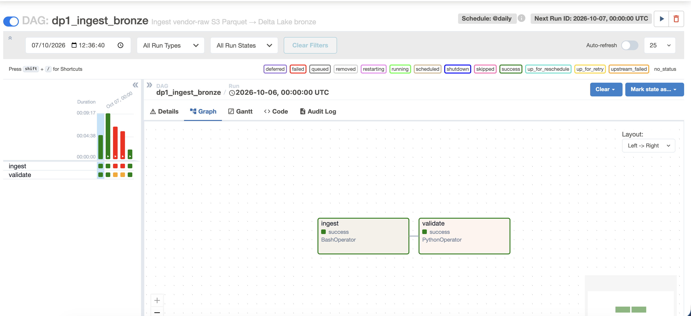

# Orchestration (Airflow)

Airflow runs the pipelines in order, retries a failed task once, and keeps a
record of every run. Without it, DP1 → DP2 → DP3 → Feast would be four manual
commands, and nothing would stop DP2 from starting on broken bronze data.

- UI: http://localhost:8083, login `admin` / `admin`
- DAG files: `platform/airflow/dags/` (mounted into the container)
- Executor: `LocalExecutor`; metadata in the `airflow` database on Postgres
- Image: `platform/docker/airflow.Dockerfile` (Airflow 2.9.3 plus a separate
  virtualenv, `/opt/ml-venv`, for Feast, MLflow and LightGBM)

---

## 1. DAGs

| DAG | Schedule | Tasks, in order | Pipeline |
|---|---|---|---|
| `dp1_ingest_bronze` | `@daily` | `ingest` → `validate` | DP1: raw data → bronze |
| `dp2_silver_gold` | `@daily` | `wait_dp1` → `ingest` → `validate` | DP2: bronze → silver → gold |
| `dp3_features` | `@daily` | `wait_dp2` → `ingest` → `validate` | DP3: gold → feature tables |
| `feast_materialize` | `@daily` | `wait_dp3` → `materialize` | Offline store → online store |
| `ml_train` | manual, or triggered by `ml_drift` | `build_labels` → `train` | Training pipeline |
| `ml_drift` | `@daily` | `check_drift` → `drift_detected` → `trigger_retrain` | Drift check, retrain on drift |

Every data pipeline has an **ingest** stage and a **validate** stage, as the
rubric asks. All DAGs use one retry with a five-minute delay and
`catchup=False`.

### DP1 on the Airflow UI



*`dp1_ingest_bronze`, run for 2026-10-06: `ingest` (BashOperator) and
`validate` (PythonOperator) both succeeded. The bars on the left are earlier
runs, including two that failed while the job was being fixed.*

> **TODO (screenshots):** the same graph view for `dp2_silver_gold`,
> `dp3_features` and `feast_materialize`, each with a successful run.

The two ML DAGs have a text record of a successful run:
[`pngs/phase3_airflow_ml_dags.txt`](pngs/phase3_airflow_ml_dags.txt).

---

## 2. How one DAG waits for the previous one

Each downstream DAG starts with a `PythonSensor` in `reschedule` mode (poke
every 30 s, time out after one hour). The sensor asks Postgres whether the
upstream pipeline has produced its result:

| Sensor | Condition |
|---|---|
| `dp2_silver_gold.wait_dp1` | `platform.job_status` has a row for `dp1_ingest_bronze` with status `ok` from the last 24 hours |
| `dp3_features.wait_dp2` | `gold.fact_daily_bar` has at least one row |
| `feast_materialize.wait_dp3` | `gold.feat_pair_daily` has at least one row |

Only the first condition is tied to a recent run. The other two are true as
soon as the table has any data, including data from an older run.

---

## 3. How a Spark job is started

The Airflow container has no Spark. The `ingest` task is a `BashOperator`
that runs `spark-submit` inside the Spark master container:

```bash
docker exec platform-spark-master-1 \
  /opt/spark/bin/spark-submit \
  --master spark://spark-master:7077 \
  /opt/spark/jobs/dp1_ingest_bronze_optimized.py \
  --s3-endpoint http://minio:4566
```

For this to work the host's Docker socket is mounted into the Airflow
container (`/var/run/docker.sock`). That gives Airflow control of every
container on the machine, so it is for a local demo only. The cleaner
alternative is `SparkSubmitOperator` with Spark installed in the Airflow image.

Spark finds the Delta, S3 and Postgres JARs in `/opt/spark/extra-jars/`,
configured in `platform/spark/conf/spark-defaults.conf`.

---

## 4. Validate stage

Each `validate` task queries Postgres through the connection `postgres_dwh`
and fails the DAG run when a check fails, so the next pipeline does not start.

| DAG | Checks |
|---|---|
| `dp1_ingest_bronze` | The latest `platform.job_status` row for DP1 exists, has status `ok`, and reports more than 0 rows written to Delta bronze |
| `dp2_silver_gold` | `silver.stg_daily_bars` is not empty and has no duplicate `(symbol, ts)`; `gold.dim_symbol` is not empty and has at most one current row per symbol; `gold.fact_daily_bar` is not empty and `log_return` is null only on the first date |
| `dp3_features` | `gold.feat_symbol_daily` is not empty and every row has `event_timestamp`; `gold.feat_pair_daily` has at least one non-null `zscore` |
| `feast_materialize` | No separate task; the `feast` command exits with an error on failure |

These are hand-written SQL assertions. There are no data-contract files yet
(`platform/contracts/` is empty) and no DataHub.

---

## 5. Connections and variables

They are defined once, as environment variables on the Airflow service in
`platform/compose.yml`, and are available to every DAG.

| Connection | Value | Used by |
|---|---|---|
| `postgres_dwh` | `postgresql://pairlab:…@postgres:5432/pairlab` | Every sensor and `validate` task |
| `spark_default` | `spark://spark-master:7077` | Defined; the DAGs currently pass the master address directly |
| `minio_s3` | `s3://<user>:<password>@minio:4566` | Defined; not read by a DAG yet |

| Variable | Value | Used by |
|---|---|---|
| `s3_endpoint` | `http://minio:4566` | `ingest` in DP1, DP2, DP3 |
| `pg_jdbc_url` | `jdbc:postgresql://postgres:5432/pairlab` | `ingest` in DP2, DP3 |
| `coint_pairs` | `KO:PEP,XOM:CVX,JPM:BAC,GS:MS` | `ingest` in DP3 |
| `pushgateway_url` | not set; the DAG falls back to `http://pushgateway:9091` | `ml_drift` |
| `minio_endpoint`, `minio_access_key`, `minio_secret_key`, `spark_master` | set | Not read by a DAG yet |

The MinIO credentials and the Fernet key come from the git-ignored `.env`
file.

Airflow does not list connections or variables that come from environment
variables in its Admin pages. Show them from the command line instead:

```bash
docker exec platform-airflow-1 airflow connections get postgres_dwh
docker exec platform-airflow-1 airflow variables get s3_endpoint
```

> **TODO (screenshot):** the output of the two commands above.
