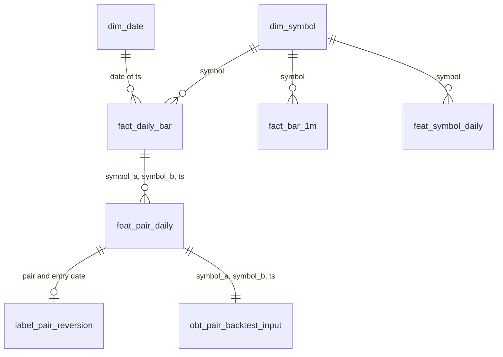

# Schema design

Data moves through three zones. Each zone exists twice: as Delta tables on
MinIO (written by Spark) and as Postgres tables (the warehouse that the
backtester, Feast and the APIs query).

| Zone | Meaning | Delta path | Postgres schema |
|---|---|---|---|
| Source | Files and tables owned by "another department" | `s3://vendor-raw/` | `vendor` |
| Bronze | As received: duplicates and old schema versions included | `s3://delta-lake/bronze/` | `bronze` |
| Silver | Deduplicated, one schema | `s3://delta-lake/silver/` | `silver` |
| Gold | Ready to use: dimensions, facts, features, one big table | `s3://delta-lake/gold/` | `gold` |

The Postgres definitions are in `platform/warehouse/init.sql` and are created
when the Postgres container first starts.

---

## 1. Naming convention

| Prefix | Zone | Meaning | Tables |
|---|---|---|---|
| `raw_` | Bronze | Unchanged input | `raw_daily_bars`, `raw_ticks` |
| `stg_` | Bronze, Silver | Cleaned or set aside ("staging") | `stg_daily_bars`, `stg_bars_1m`, `stg_rejected_daily_bars` |
| `dim_` | Gold | Dimension: who or what | `dim_symbol`, `dim_date` |
| `fact_` | Gold | Fact: measurements at a point in time | `fact_daily_bar`, `fact_bar_1m` |
| `feat_` | Gold | Feature table for ML | `feat_symbol_daily`, `feat_pair_daily` |
| `label_` | Gold | Training label | `label_pair_reversion` |
| `obt_` | Gold | One big table, already joined | `obt_pair_backtest_input` |

---

## 2. Tables in every zone

### Source — `vendor`

| Table | Key | Content |
|---|---|---|
| `vendor.symbols` | `(symbol, listed_at)` | Symbol master: `name`, `sector`, `listed_at`, `delisted_at` |

Daily bars arrive as Parquet files in
`s3://vendor-raw/daily_bars/schema_version=1|2|3/`, and the symbol master as
`s3://vendor-raw/symbol_master.parquet`.

### Bronze

| Table | Key | Content |
|---|---|---|
| `bronze.raw_daily_bars` | none (duplicates allowed) | `symbol`, `ts`, OHLC, `volume`, `adj_close` (schema v2), `schema_version`, `ingest_ts`, `source_file` |
| `bronze.raw_ticks` | none | `trade_id`, `symbol`, `event_ts`, `price`, `quantity`, `side`, `ingest_ts` |
| `bronze.stg_rejected_daily_bars` | none | Quarantine: `symbol`, `ts`, `reject_reason`, `raw_json` |

The bronze data the pipeline uses is the Delta table
`s3://delta-lake/bronze/daily_bars/`, written by DP1. The three Postgres
bronze tables are defined, but no job loads them at present.

### Silver

| Table | Key | Content |
|---|---|---|
| `silver.stg_daily_bars` | `(symbol, ts)` | One row per symbol and day: OHLC, `adj_close`, `volume`, `split_factor`, `schema_version` |
| `silver.stg_bars_1m` | `(symbol, window_start)` | 1-minute bars from Flink: OHLC, `volume`, `tick_count` |

### Gold

| Table | Key | Content |
|---|---|---|
| `gold.dim_symbol` | `dim_symbol_key` | SCD2 dimension, see section 3 |
| `gold.dim_date` | `date_key` (YYYYMMDD) | Calendar 2020–2030: year, quarter, month, week, day of week, `is_trading_day` |
| `gold.fact_daily_bar` | `(symbol, ts)` | Daily OHLC, `adj_close`, `volume`, `daily_return`, `log_return` |
| `gold.fact_bar_1m` | `(symbol, window_start)` | 1-minute OHLC, `volume`, `tick_count` |
| `gold.feat_symbol_daily` | `(symbol, ts)` | See section 4 |
| `gold.feat_pair_daily` | `(symbol_a, symbol_b, ts)` | See section 4 |
| `gold.label_pair_reversion` | `pair_date_id` | Two columns: `pair_date_id` (e.g. `KO__PEP|2020-03-02`) and `label` |
| `gold.obt_pair_backtest_input` | `(symbol_a, symbol_b, ts)` | Both legs' prices and volume, pair features and label in one row |

Two more schemas hold supporting objects:

| Object | Purpose |
|---|---|
| `feast.feat_symbol_daily`, `feast.feat_pair_daily` (views) | What the Feast offline store reads; each is `SELECT *` from the gold table |
| `platform.job_status` | One row per Spark job run (`job`, `ran_at`, `rows_out`, `status`); read by Airflow |

> **TODO (DBeaver screenshots):** the table list of the schemas `vendor`,
> `bronze`, `silver`, `gold`, `feast`, and the Delta folders in the MinIO
> console (http://localhost:9001).

---

## 3. Dimension with SCD Type 2 — `gold.dim_symbol`

A plain dimension stores only the current value, so a change overwrites
history. SCD Type 2 keeps one row per *period*: when an attribute changes, the
old row is closed and a new one is added.

| Column | Type | Meaning |
|---|---|---|
| `dim_symbol_key` | `SERIAL` | Surrogate key, one per version |
| `symbol` | `TEXT` | Business key |
| `name`, `sector` | `TEXT` | Tracked attributes |
| `listed_at`, `delisted_at` | `DATE` | Listing period |
| **`valid_from_ts`** | `TIMESTAMPTZ` | When this version became true |
| **`valid_to_ts`** | `TIMESTAMPTZ` | When it stopped being true; `NULL` for the current version |
| **`is_current`** | `BOOLEAN` | `TRUE` for the current version |
| `change_reason` | `TEXT` | Why a new version was created |

**Why it matters here.** A backtest for 2020 must use the stocks that were
listed in 2020, including those delisted later. Using today's list silently
drops the companies that failed and makes every strategy look better
(*survivorship bias*). The point-in-time query is:

```sql
SELECT symbol, sector
FROM gold.dim_symbol
WHERE valid_from_ts <= :as_of
  AND (valid_to_ts IS NULL OR valid_to_ts > :as_of);
```

The unique index `idx_dim_symbol_current` (`symbol` where `is_current`) makes
the database refuse a second current row for the same symbol.

How the job fills this table, and what it does not do yet, is in
[processing_jobs.md](processing_jobs.md) §1.2.

> **TODO (DBeaver screenshot):** `SELECT * FROM gold.dim_symbol WHERE symbol =
> 'CVX' ORDER BY valid_from_ts` showing the closed `Energy` row and the
> current `Energy-Alt` row, once the SCD2 fix is in.

---

## 4. Feature tables

Both feature tables carry the two timestamp columns Feast needs:

| Column | Meaning |
|---|---|
| **`event_timestamp`** | The time the feature describes. Feast uses it to join a feature to a label without looking into the future |
| **`created`** | The time the row was written. When the same event is written twice, Feast takes the newer row |

| Table | Entity | Features |
|---|---|---|
| `gold.feat_symbol_daily` | `symbol` | `vol_21d`, `vol_63d`, `ret_21d`, `ret_63d`, `atr_14d` |
| `gold.feat_pair_daily` | `symbol_a`, `symbol_b` | `hedge_ratio`, `coint_pvalue`, `half_life`, `zscore`, `spread_vol`, `correlation_60d` |

`coint_pvalue` and `half_life` are columns in the table definition; DP3 does
not compute them yet.

> **TODO (DBeaver screenshot):** the column list of both tables with
> `event_timestamp` and `created` visible.

---

## 5. Relationships between dimensions and facts



These are logical relationships: the tables share the columns shown, and the
jobs join on them. `init.sql` declares primary keys but no foreign-key
constraints. Spark reloads each table in full with `TRUNCATE`, which Postgres
refuses on a table that a foreign key points to. A fact row joins to the dimension version that was
valid at the row's `ts` (the query in section 3).

> **TODO (DBeaver):** export the ER diagram of the `gold` schema and add it
> here.

---

## 6. Indexes

Every primary key in section 2 has an index. `init.sql` adds these:

| Index | Table and columns | Speeds up |
|---|---|---|
| `idx_raw_daily_bars_symbol_ts` | `bronze.raw_daily_bars (symbol, ts)` | Finding duplicates |
| `idx_raw_ticks_symbol_event_ts` | `bronze.raw_ticks (symbol, event_ts)` | Reading one symbol's ticks in time order |
| `idx_dim_symbol_current` (unique, partial) | `gold.dim_symbol (symbol) WHERE is_current` | Current version lookup; enforces one current row |
| `idx_dim_symbol_symbol_period` | `gold.dim_symbol (symbol, valid_from_ts, valid_to_ts)` | Point-in-time lookup |
| `idx_fact_daily_bar_ts_symbol` | `gold.fact_daily_bar (ts, symbol)` | "All symbols on one day", which the backtester reads bar by bar |
| `idx_obt_backtest_ts` | `gold.obt_pair_backtest_input (ts)` | Reading the one big table by date range |

> **TODO (proof):** `EXPLAIN ANALYZE` of one query on `gold.fact_daily_bar`
> filtered by `ts`, with and without `idx_fact_daily_bar_ts_symbol`.

---

## 7. To check: Delta tables against the Postgres definitions

The Spark jobs copy Delta tables into the Postgres tables above with
`truncate=true`, which keeps the Postgres definition. The copy only succeeds
when the two sides have matching columns. These differences are visible in
the code and should be confirmed on a database created from a clean volume:

| Table | Postgres definition | What the Spark job writes |
|---|---|---|
| All tables with `ts` | `TIMESTAMPTZ` | `ts` is a nanosecond integer in the Delta tables |
| `gold.dim_symbol` | `listed_at NOT NULL`, plus `name`, `delisted_at`, `change_reason` | `symbol`, `sector`, `valid_from_ts`, `valid_to_ts`, `is_current` |
| `silver.stg_daily_bars` | `split_factor`; no `dt`, `silver_ts`, `source_exchange` | Has `dt`, `silver_ts`, `source_exchange`; no `split_factor` |
| `gold.feat_pair_daily` | Features only, plus `coint_pvalue`, `half_life` | Also `close_a`, `close_b`, `ret_a`, `ret_b`, `spread`, `spread_mean`; no `coint_pvalue`, `half_life` |
| `gold.feat_symbol_daily` | Key, timestamps and the five features | Also the price columns carried over from `fact_daily_bar` |
| `gold.obt_pair_backtest_input` | `label`, `coint_pvalue`, `half_life` | No `label`, `coint_pvalue` or `half_life`; adds `high_*`, `low_*` and others |

One more gap: `gold.dim_date` covers 2020–2030, while the default dataset
starts in 2018.
